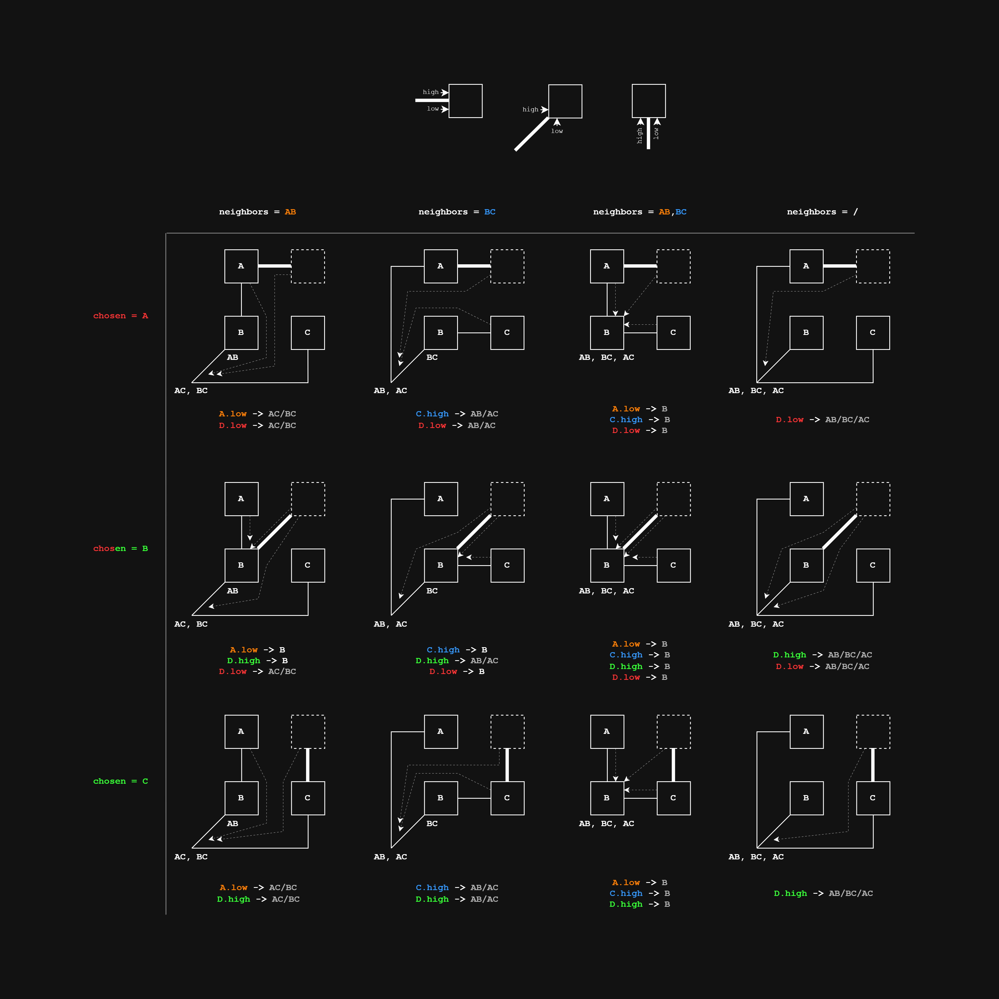
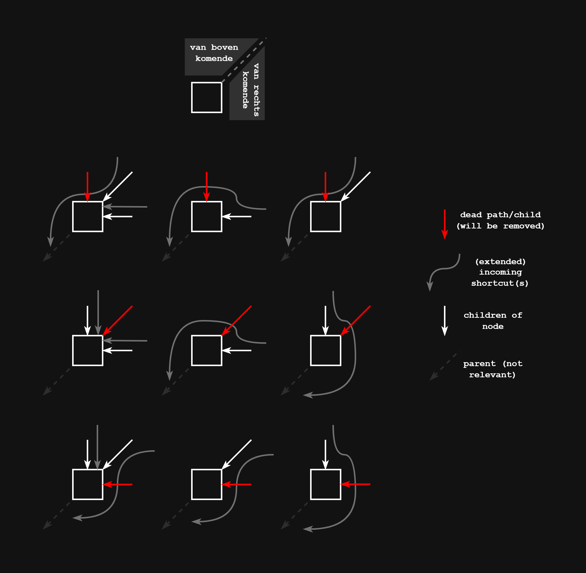

# DiscreteFrechetMatching
An analysis of different discrete locally correct (retractable) Fréchet matching algorithms.

The discrite Fréchet distance is a measure of the similarity between two curves. It is defined as the minimum length of a leash required to connect a dog and its owner as they walk along their respective curves, without backtracking. The discrete Fréchet distance is a variant of the Fréchet distance that is computed using a discrete set of points along the curves, rather than continuous curves. When calculating the "locally correct" (also referred to as "retractable") variant of this distance, the matching is restricted so that the leash is kept as short as possible at any point in time.

This repository contains implementations of two different algorithms for computing the discrete locally correct Fréchet distance and matching between two curves, as well as scripts for testing their correctness and benchmarking their performance.

### Some visualizations

*Case distinction for when and where to create shortcuts for a new node.*


*Possible shortcut extensions for a node, given a dead path and incoming shortcuts.*


## Algorithms
In this project we are interested in 2 different algorithms for computing the discrete locally correct Fréchet matching between two curves: the **BBMS** algorithm and the **DijkstraPrims** algorithm:

### BBMS
Based on the paper "Locally correct Fréchet matchings" by Buchin, K., Buchin, M., Meulemans, W., & Speckmann, B. (2012). "

In the repository, we use 3 versions of this algorithm: `BBMS_core`, which is a simplified version without any optimizations, `BBMS_inter`, which includes shortcut optimizations, and `BBMS`, which includes the shortcut optimizations and dead path pruning as described in the paper.

### DijkstraPrims
Based on the paper "The Fréchet Distance Unleashed: Approximating a Dog with a Frog" by Sariel Har-Peled, Benjamin Raichel and Eliot W. Robson (2026). 

## File Structure

- `experiments` : Contains scripts for running experiments to compare the performance of the different algorithms. Each subdirectory contains a separate experiment, with its own main script and any necessary helper functions or data.
    - `example/`: See [Example experiment](#example-experiment) below for a description of this experiment.
    - `polyline_length_effect/`: See [Polyline length effect experiment](#polyline-length-effect-experiment) below for a description of this experiment.
    - `total_runtime_benchmark/`: See [Total runtime experiment](#total-runtime-experiment) below for a description of this experiment.
- `figures` : Contains figures/diagrams used during development, in the README, or elsewhere. 
- `polyline_datasets/`: Contains scripts for generating and loading datasets of polylines for use in testing and benchmarking the algorithms. Also includes the generated datasets themselves.
    - `generate_polylines.py`: Contains a script for generating random polylines with specified parameters (number of polylines, length range, x and y coordinate ranges).
    - `load_polylines.py`: Contains a function for loading polylines from a text file. The text file should be formatted so that each curve is represented by multiple lines of x and y coordinates, with curves ordered in pairs (i.e. the first two curves form a pair to be compared, the next two curves form another pair, etc.).
- `src/`: Contains the implementations of the different algorithms for computing the discrete locally correct Fréchet distance and matching, as well as any necessary helper functions and classes.
    - `Point.py`: Contains the definition of the `Point` class, which represents a point in 2D space with x and y coordinates. This class is used throughout the implementations of the algorithms to represent the vertices of the curves.
    - `helper.py`: Contains helper functions required by all algorithms (such as distance calculations) and functions that are useful for development.
    - `BBMS/` : Contains the implementation of the discrete locally correct Fréchet matching algorithm, as described in the paper "Locally correct Fréchet matchings" by Buchin, K., Buchin, M., Meulemans, W., & Speckmann, B. (2012). **Note: The current implementation of this algorithm does not yet include the dead path pruning described in the paper.**
    - `BBMS_core/` : Contains a simplified version of the BBMS algorithm. This implementation does not include any shortcut optimizations or dead path pruning and serves as a baseline for comparison with the optimized version in `BBMS/`. Mainly used for testing and debugging purposes.
    - `BBMS_inter/` : Contains an intermediate version of the BBMS algorithm. This implementation includes shortcut optimizations described in the paper, except for the dead path pruning. It serves as a stepping stone between `BBMS_core/` and the fully optimized version in `BBMS/`, and is useful for testing and debugging purposes.
    - `DijkstraPrims/` : Contains the implementation of the discrete locally correct Fréchet matching algorithm, as described in the paper "The Fréchet Distance Unleashed: Approximating a Dog with a Frog" by Sariel Har-Peled, Benjamin Raichel and Eliot W. Robson (2026).
    - `DynamicProgramming/` : Contains the "standard" implementation of the discrete Fréchet **distance** algorithm using dynamic programming.
- `tests` : Contains scripts for testing the correctness of the different algorithms by comparing their outputs on the same test curves.
    - `compare_matching.py`: Compares the matchings between BBMS_core, BBMS_inter and BBMS, to ensure that the shortcut optimizations in BBMS do not change the resulting matching.
    - `compare_frechet_distance.py`: Compares the Fréchet distances produced by all three algorithms to the distance produced by the dynamic programming solution, to ensure that all algorithms are producing the correct distance.


## Experiments
Below is a description of the experiments included in the `experiments/` directory. Each experiment is contained in its own subdirectory, with a main script that can be run to execute the experiment.

### Example experiment
The `example` experiment contains a simple script that demonstrates how to use the different algorithms to compute the discrete locally correct Fréchet distance and matching between two curves. The script defines two simple curves (each consisting of 3 points) and runs all three algorithms on these curves, printing the resulting distances and matchings to the console. This experiment serves as a basic demonstration of how to use the algorithms and can be used as a starting point for developing more complex experiments.

### Polyline length effect experiment
The `polyline_length_effect` experiment contains a script for benchmarking the runtime of the different algorithms on pairs of curves of varying lengths. The script generates a specified number of random polylines with lengths in a specified range, runs the specified algorithm on each consecutive pair of curves, and records the runtime for each pair. The results are printed to the console at the end of the experiment, showing how the runtime of each algorithm changes as the length of the curves increases.

### Total runtime experiment
The `total_runtime` experiment contains a script for benchmarking the total runtime of the different algorithms on a set of test curves. The script loads a set of curves from a specified text file, runs the specified algorithm on each consecutive pair of curves, and records the total runtime. The results are printed to the console at the end of the experiment.


---


### Run experiments
To run the example experiment (or any other experiment), please run the following command from the root directory of the repository:

```bash
python -m experiments.example.main
```

_Note: You can replace "example" with the name of any other experiment subdirectory to run that experiment instead (e.g. `python -m experiments.total_runtime.main`)._


## Tests
Correctness tests are done by comparing the outputs of the algorithms on the same test curves, and checking for any mismatches in the resulting matchings or distances.

There are two scripts for checking the correctness of the algorithms: `tests/compare_matching.py` (see [Compare matchings](#compare-matchings)) and `tests/compare_frechet_distance.py` (see [Compare Fréchet distances](#compare-fréchet-distances)). 

### Compare matchings
The script will run BBMS_core, BBMS_inter and BBMS on the same pairs of curves loaded from the specified file and compare their matchings. If any mismatches are found, they will be printed to the console along with details about the curves and the matchings. 

To compare the matchings produced by BBMS_core, BBMS_inter and BBMS, run the following command:

```bash
python -m tests.compare_matching <filename>
```

`<filename>` should be the name of the .txt file in `polyline_datasets/` that contains the curves you want to compare (e.g. `sample_polylines`). 


### Compare Fréchet distances
The script will run the specified algorithm on each pair of curves loaded from the specified file and compare the resulting Fréchet distance to the distance produced by the dynamic programming solution. If any mismatches are found, they will be printed to the console along with details about the curves and the distances.

To compare the Fréchet distances produced by one of the three algorithms to the distance produced by the dynamic programming solution, run the following command:

```bash
python -m tests.compare_frechet_distance <filename> <algorithm>
```

`<filename>` should be the name of the .txt file in `polyline_datasets/` that contains the curves you want to compare (e.g. `sample_polylines`). 

`<algorithm>` should be the name of the algorithm you want to compare to the dynamic programming solution. Valid options are: `bbms`, `bbms_core`, `bbms_inter`, and `dijkstraprims`.

